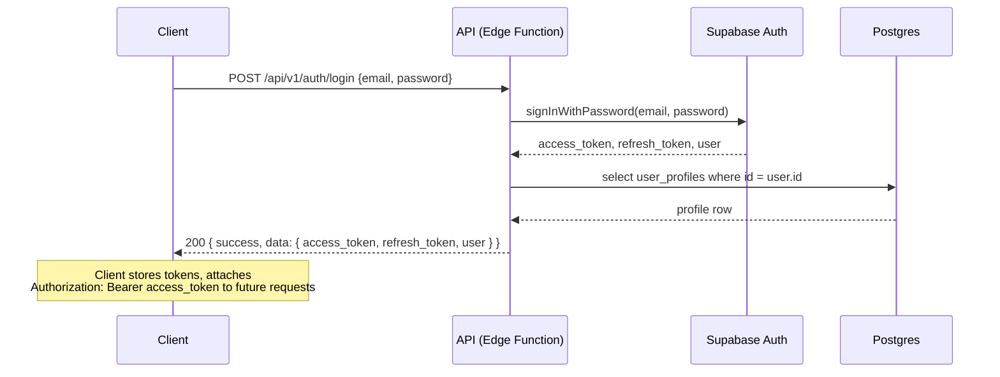
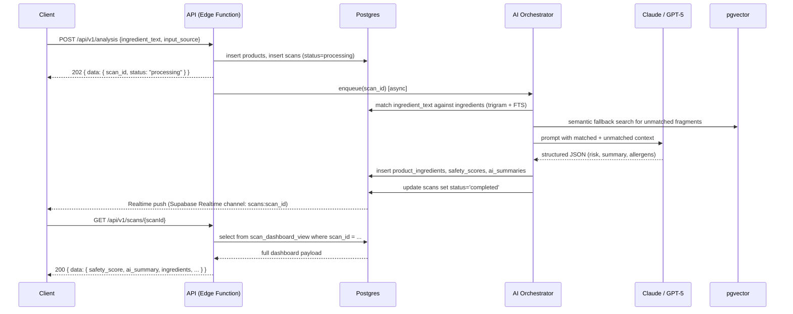
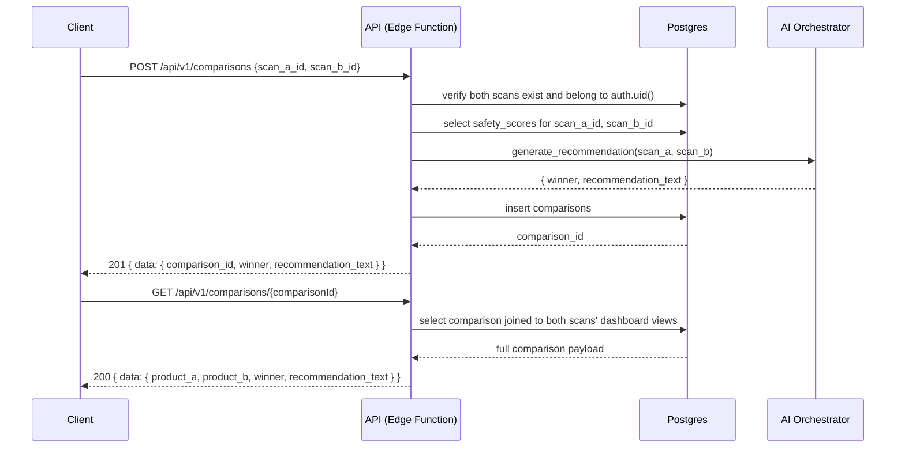

# API Sequence Diagrams — NutriGuard AI

## 1. Login



## 2. Ingredient Analysis



## 3. Product Comparison



## 4. History Retrieval

```mermaid
sequenceDiagram
    participant Client
    participant API as API (Edge Function)
    participant DB as Postgres

    Client->>API: GET /api/v1/scans?limit=20&cursor=...
    API->>DB: select from scan_dashboard_view where user_id = auth.uid() and scanned_at < cursor order by scanned_at desc limit 20
    Note over DB: RLS policy auto-filters to auth.uid();<br/>composite index (user_id, scanned_at desc) used
    DB-->>API: 20 scan rows + next cursor
    API-->>Client: 200 { data: [...], meta: { next_cursor } }
```
