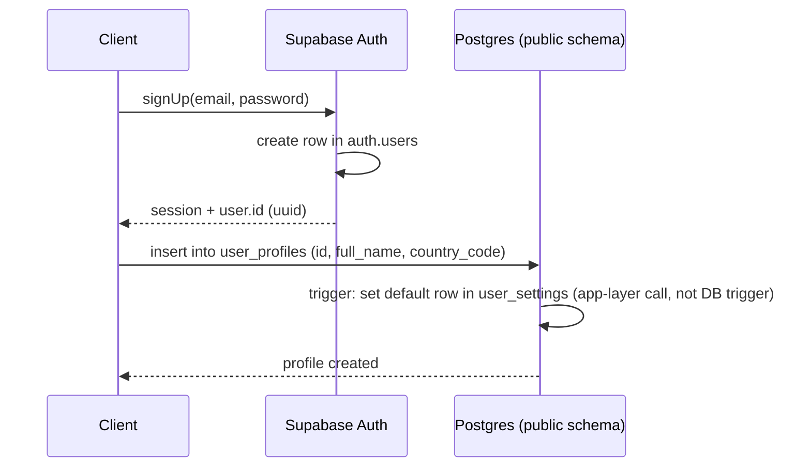
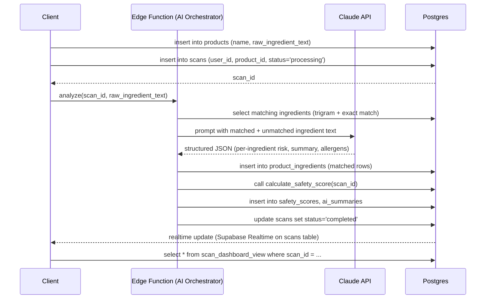
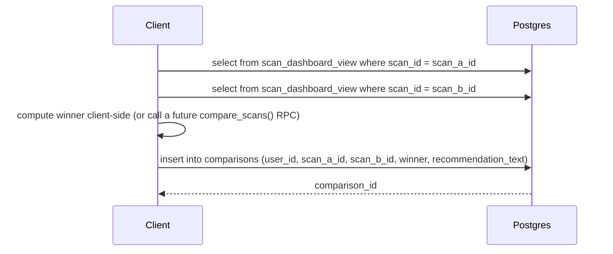
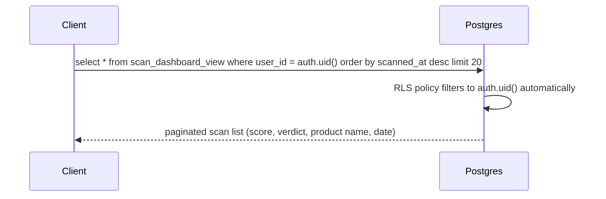

# Data Flow Diagrams — NutriGuard AI

## 1. User Registration

```mermaid
sequenceDiagram
    participant Client
    participant Supabase Auth
    participant Postgres (public schema)

    Client->>Supabase Auth: signUp(email, password)
    Supabase Auth->>Supabase Auth: create row in auth.users
    Supabase Auth-->>Client: session + user.id (uuid)
    Client->>Postgres (public schema): insert into user_profiles (id, full_name, country_code)
    Postgres (public schema)->>Postgres (public schema): trigger: set default row in user_settings (app-layer call, not DB trigger)
    Postgres (public schema)-->>Client: profile created
```

## 2. Ingredient Analysis (Scan)

```mermaid
sequenceDiagram
    participant Client
    participant Edge Function (AI Orchestrator)
    participant Claude API
    participant Postgres

    Client->>Postgres: insert into products (name, raw_ingredient_text)
    Client->>Postgres: insert into scans (user_id, product_id, status='processing')
    Postgres-->>Client: scan_id
    Client->>Edge Function (AI Orchestrator): analyze(scan_id, raw_ingredient_text)
    Edge Function (AI Orchestrator)->>Postgres: select matching ingredients (trigram + exact match)
    Edge Function (AI Orchestrator)->>Claude API: prompt with matched + unmatched ingredient text
    Claude API-->>Edge Function (AI Orchestrator): structured JSON (per-ingredient risk, summary, allergens)
    Edge Function (AI Orchestrator)->>Postgres: insert into product_ingredients (matched rows)
    Edge Function (AI Orchestrator)->>Postgres: call calculate_safety_score(scan_id)
    Edge Function (AI Orchestrator)->>Postgres: insert into safety_scores, ai_summaries
    Edge Function (AI Orchestrator)->>Postgres: update scans set status='completed'
    Postgres-->>Client: realtime update (Supabase Realtime on scans table)
    Client->>Postgres: select * from scan_dashboard_view where scan_id = ...
```

## 3. Product Comparison

```mermaid
sequenceDiagram
    participant Client
    participant Postgres

    Client->>Postgres: select from scan_dashboard_view where scan_id = scan_a_id
    Client->>Postgres: select from scan_dashboard_view where scan_id = scan_b_id
    Client->>Client: compute winner client-side (or call a future compare_scans() RPC)
    Client->>Postgres: insert into comparisons (user_id, scan_a_id, scan_b_id, winner, recommendation_text)
    Postgres-->>Client: comparison_id
```

## 4. Scan History Retrieval

```mermaid
sequenceDiagram
    participant Client
    participant Postgres

    Client->>Postgres: select * from scan_dashboard_view where user_id = auth.uid() order by scanned_at desc limit 20
    Postgres->>Postgres: RLS policy filters to auth.uid() automatically
    Postgres-->>Client: paginated scan list (score, verdict, product name, date)
```
